# Diagnosis Report — Agent Execution Service

All evidence in this report comes from a **real, running** instance of the
instrumented stack (`docker compose up`) driven by `tests/test_load.py`.

**Baseline load test** used throughout this document:

| Parameter | Value |
| --------- | ----- |
| Requests / concurrency | 100 / 15 |
| Window (browser TZ) | 2026-07-03 18:19:22 → 18:21:23 (~121 s) |
| Grafana range used for screenshots | `from=1783095557000&to=1783095688000` |
| Outcome | **90 completed, 10 failed** (all failures = 30 s timeouts) |
| Latency | P50 = 15.7 s, **P95 = 30.0 s, P99 = 30.0 s** (wall) |
| LLM calls | **262 for 100 tasks** (plan 90, summarise 88, validate 84) |
| Retries | 42 (30 × HTTP 500, 12 × HTTP 429) |
| Est. cost | ≈ $0.73 total |

Raw exports for this baseline:
`evidence/loadtest_step2_baseline.txt`,
`evidence/metrics_snapshot_step2_baseline.txt`,
`evidence/trace_slow_task_step2_baseline.json`.

> The mock LLM's unreliability (≈10 % 500s, ≈5 % 429s, ≈5 % latency spikes) is
> **intentional and not counted as an issue**. Everything below is behaviour of
> the *agent service itself*.

---

## Issues, ranked most → least important

| # | Issue | Type | Primary impact | Severity | Status |
| - | ----- | ---- | -------------- | -------- | ------ |
| 1 | Per-tenant global lock serialises all of a tenant's tasks | Design-under-load | Throughput collapse, timeouts, head-of-line blocking | **Critical** | ✅ **Fixed** |
| 2 | `priority` is collected but never used for scheduling | Design-under-load | Priority inversion; `urgent` waits behind `low` | **High** | ✅ **Fixed** |
| 3 | Redundant 4th LLM call (`validate`) whose result is discarded | Bug / waste | ~32 % extra LLM cost, latency, failure surface | **High** | ✅ **Fixed** |
| 4 | Unbounded in-memory stores (`task_store`, `_response_cache`, `_execution_log`) | Bug-over-time | Memory leak → OOM under sustained load | **High** | ✅ **Fixed** |
| 5 | Uniform retry policy + retries inside a shared rate limiter | Design-under-load | LLM load amplification; 429 mis-handling | **Medium** | ✅ **Fixed** |
| 6 | Token/cost over-accounting on 500 retries | Bug (accuracy) | Inflated per-tenant cost metrics | **Low** | ✅ **Fixed** |

The sections below give evidence + root cause for each. **Fix & Verify**
sub-sections are added incrementally as each fix is implemented.

---

## Issue #1 — Per-tenant global lock serialises a tenant's entire workload (Critical)

### Evidence

**Golden signals (windowed to the load test):**

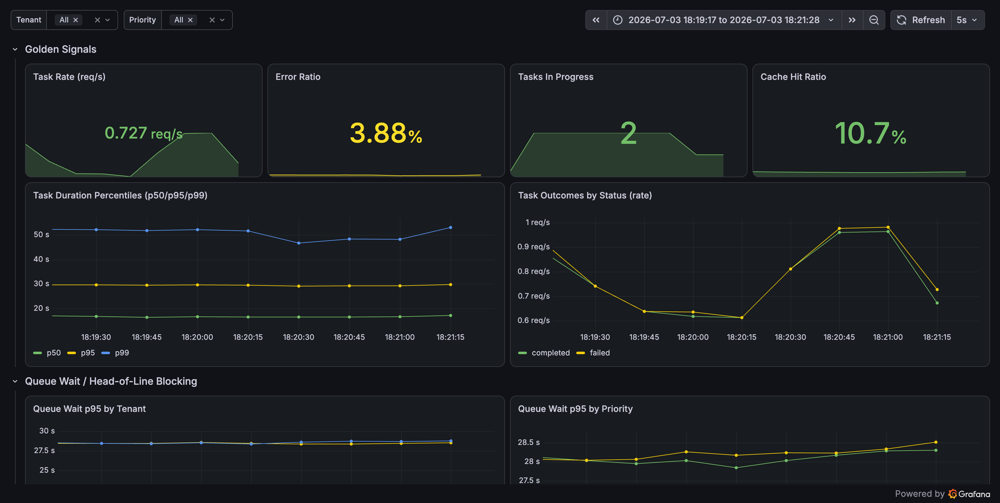

- **Tasks In Progress = 2** even though `MAX_CONCURRENT_TASKS = 5`. The service
  never uses its own concurrency budget.
- **Task Duration:** P50 ≈ 15 s, **P95 pinned at the 30 s timeout**, P99 ≈ 50 s
  (histogram aggregation of the 30 s+ tail).
- **Queue Wait p95 ≈ 28 s** for *every* tenant and *every* priority.

**The decisive trace** (`e86cff7ee5e020c3b4e1bfb90e8faa38`, a timed-out task):

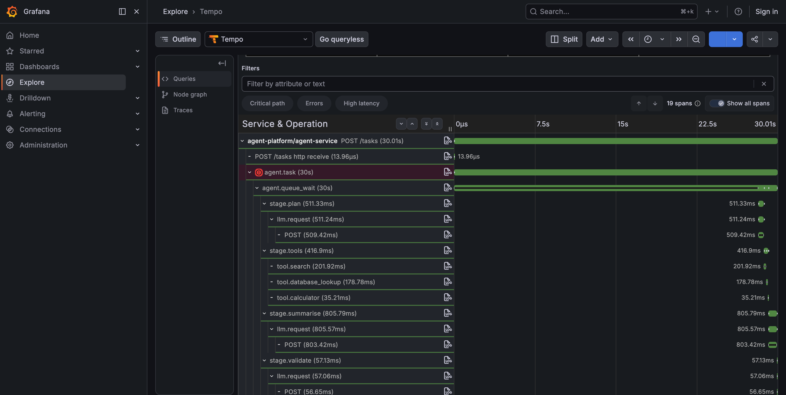

| Span | Duration |
| ---- | -------- |
| `agent.task` | **30.0 s (timed out)** |
| `agent.queue_wait` | **30.0 s** |
| `stage.plan` | 511 ms |
| `stage.tools` | 417 ms |
| `stage.summarise` | 806 ms |
| `stage.validate` | 57 ms |
| **Actual work** | **≈ 1.8 s** |

The task did **~1.8 s of real work but was killed at 30 s** — it spent
28+ seconds waiting in the queue. The problem is *not* slow work; it is waiting.

### Root cause

`src/main.py` wraps every execution in a **per-tenant `asyncio.Lock`**, and
acquires it *before* the global concurrency semaphore:

```python
lock = _tenant_locks.setdefault(body.tenant_id, asyncio.Lock())
async with lock:                 # ← only ONE task per tenant at a time
    async with _task_semaphore:  # semaphore is effectively unreachable
        return await run_task(...)
```

With only 3 tenants in the load test, at most **3 tasks can run at once**
(one per tenant), so `MAX_CONCURRENT_TASKS = 5` is never reached — matching the
observed *Tasks In Progress = 2–3*. Each task takes ~1.8 s of real work but the
pipeline also stalls on slow/retried LLM calls, so a tenant's queue backs up and
later tasks blow through the 30 s deadline while doing almost nothing.

The lock's stated purpose ("prevent race conditions on downstream tenant
state") is unnecessary here: `run_task` shares no mutable per-tenant state
across requests. It is strict serialisation bought for no benefit.

### Discovery path

1. Dashboard showed **P95 latency flat at exactly 30 s** — a suspiciously round
   number that screams "deadline", not organic latency.
2. *Tasks In Progress* sat at 2–3, never near 5 → the concurrency limit wasn't
   the binding constraint; something upstream was.
3. The dedicated **Queue Wait** panel showed ~28 s p95 across all tenants →
   tasks were waiting, not working.
4. Opening a timed-out trace confirmed it: `agent.queue_wait` ≈ 30 s while the
   sum of real stage work was < 2 s. Reading `main.py` revealed the per-tenant
   lock acquired before the semaphore.

### Proposed fix

Replace the per-tenant **mutex** (a semaphore of size 1) with a per-tenant
**bounded semaphore** of size `MAX_CONCURRENT_TASKS_PER_TENANT` (> 1), so a
tenant's tasks can run in parallel — while still capping each tenant so it
cannot monopolise the global budget or fan out to unbounded concurrency.

### Fix implemented

We deliberately did **not** remove per-tenant limiting entirely. Unbounded
per-tenant concurrency would let a single tenant spin up thousands of agents and
silently run up the LLM bill. Instead we bound it:

**`src/config.py`** — new tunable (env-overridable), default 3:

```python
MAX_CONCURRENT_TASKS = 5
MAX_CONCURRENT_TASKS_PER_TENANT = 3
```

**`src/main.py`** — `asyncio.Lock` per tenant → bounded `asyncio.Semaphore`,
and the **global semaphore is now acquired *before* the per-tenant one**, so a
task blocked at its tenant cap never holds a scarce global slot while waiting:

```python
# before:  async with tenant_lock:        # size 1 → strict serialisation
#              async with _task_semaphore: # unreachable
# after:
async with _task_semaphore:                # global budget first
    async with tenant_sem:                 # per-tenant cap (size 3)
        ...run_task...
```

What it does & why it solves the issue: a tenant can now use up to 3 of the 5
global slots concurrently, so multiple tenants interleave and the service
actually reaches its concurrency budget. The 30 s deadline is no longer consumed
by queue waiting, so tasks that only need ~2 s of work finish in ~2 s instead of
being killed at 30 s. The per-tenant cap preserves cost/blast-radius protection.

### Before / after (identical 100-request / concurrency-15 load test)

| Signal | Before (baseline) | After (fix) | Change |
| ------ | ----------------- | ----------- | ------ |
| Completed / Failed | 90 / **10** | **100 / 0** | no more timeouts |
| Error ratio | 3.88 % | **0 %** | ✅ |
| Task rate | 0.727 req/s | **1.07 req/s** | +47 % throughput |
| Latency P50 | 15.7 s | **9.5 s** | −40 % |
| Latency P95 | **30.0 s (wall)** | **20.8 s** | off the deadline |
| Latency P99 / Max | 30.0 s / 30.04 s | **24.2 s / 24.2 s** | no 30 s tail |
| Tasks In Progress | 2 | **5** (verified) | uses full budget |
| Queue Wait p95 | ~28 s | **~18 s** | −36 % |
| Wall-clock for 100 reqs | ~121 s | **~81 s** | −33 % |

**After — golden signals** (windowed `1783096356000`–`1783096447000`):

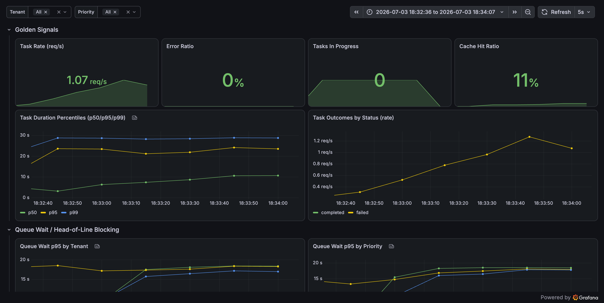

Error Ratio 0 %, task rate 1.07 req/s, P95 off the wall, only a `completed`
outcome line.

**After — worst-case trace** (`885748e56b62b53528e9acbbb0a586fb`, 24.2 s, and it
**completed**):

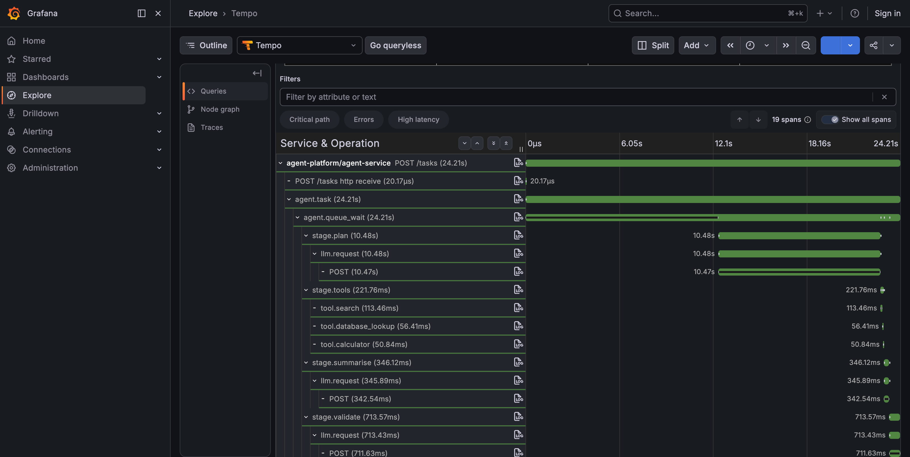

The remaining latency is now **real LLM work** — `stage.plan` alone is 10.48 s
here (an intentional mock latency-spike + retries), not queue waiting. Contrast
with the baseline timed-out trace where 30 s of `agent.queue_wait` sat on top of
< 2 s of work. Latency is now dominated by the downstream LLM (the intentional
unreliability), which is exactly what we want to see: the *self-inflicted*
blocking is gone.

Evidence exports: `evidence/metrics_snapshot_step2_fix1.txt`,
`evidence/trace_slow_task_step2_fix1.json`, `evidence/loadtest_step2_fix1.txt`.

### Re-validation at 3× load (300 requests)

To confirm the fix isn't just masking the problem at low volume, we re-ran the
**same** test at `TOTAL_REQUESTS = 300` (concurrency 15). The improvement holds
— in fact latency is marginally *better* thanks to sustained pipelining:

| Signal | 100 req (baseline) | 100 req (fix) | **300 req (fix)** |
| ------ | ------------------ | ------------- | ----------------- |
| Completed / Failed | 90 / **10** | 100 / 0 | **300 / 0** |
| Error ratio | 3.88 % | 0 % | **0 %** (panel: "No data" ⇒ no `failed` series) |
| Task rate (peak) | 0.73 req/s | 1.07 req/s | **1.36 req/s** |
| Latency P50 | 15.7 s | 9.5 s | **8.5 s** |
| Latency P95 | 30.0 s (wall) | 20.8 s | **18.0 s** |
| Latency P99 / Max | 30.0 / 30.04 s | 24.2 / 24.2 s | **21.0 / 23.5 s** |
| Tasks In Progress | 2 | 5 | **5 (sustained)** |

**300-request golden signals** (windowed `1783096861000`–`1783097052000`):

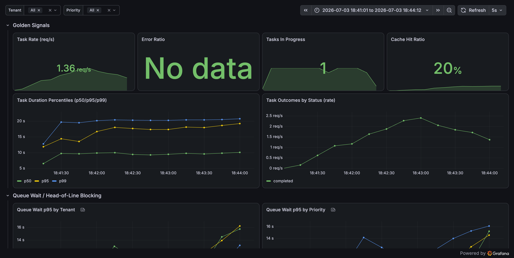

Zero failures across 300 tasks (Error Ratio shows *"No data"* because the
`failed` time series never appears), P95 steady at ~18 s, *Tasks In Progress*
holding at 5 for the whole run.

**300-request pipeline view:**

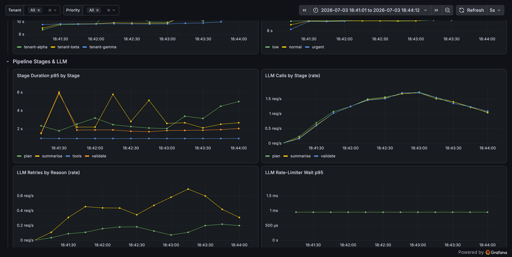

The per-tenant cap keeps things bounded: queue-wait p95 plateaus (~10 s) rather
than running away, and the client-side rate-limiter wait stays ~1 ms — i.e. the
LLM rate limiter is still not the bottleneck even at 3× load. The remaining LLM
behaviour (3 calls/task, steady 500/429 retries) is untouched and sets up
Issues #3 and #5.

Exports: `evidence/loadtest_step2_fix1_300.txt`,
`evidence/metrics_snapshot_step2_fix1_300.txt`.

**Conclusion:** Fix #1 is validated under sustained 3× load — no timeouts, lower
latency, higher throughput, and the per-tenant limit still protects against
runaway cost/fan-out.

> Note: this fix also renames the store-size gauge label `tenant_locks` →
> `tenant_semaphores` (the structure changed). The unbounded-growth of the other
> stores (Issue #4) is unaffected and still visible.

---

## Issue #2 — `priority` is collected but never scheduled on (High)

### Evidence

- The request model accepts `priority` (`urgent|normal|low`); it is propagated
  into spans (`task.priority`) and metric labels, but **no code branches on it**.
- **Queue Wait p95 by Priority** (top-row screenshot) shows `urgent`, `normal`
  and `low` **overlapping at ~28 s** — urgent tasks wait exactly as long as low.

### Root cause

Scheduling is plain FIFO within each per-tenant lock. There is no priority
queue, no preemption, no weighting. A `low`-priority batch job submitted first
blocks an `urgent` request behind it (priority inversion).

### Discovery path

Added `priority` as a first-class metric/label dimension precisely so it could
be sliced. Slicing Queue Wait by priority showed the three lines sitting on top
of each other — the system is provably priority-blind.

### Proposed fix

Once Issue #1's lock is removed, introduce priority-aware admission (e.g. a
priority queue feeding the semaphore, or a weighted fair scheduler) so `urgent`
work is admitted ahead of `low`.

### Fix implemented

`asyncio.Semaphore` cannot honour priority — when a slot frees it wakes waiters
in roughly arrival order. So we replaced the global semaphore with a
**priority admission gate** (`src/admission.py`,
`PriorityAdmissionController`):

- Up to `MAX_CONCURRENT_TASKS` run concurrently (same global budget).
- When full, waiters are ordered in a heap by
  **(priority_rank, submission_seq)** → higher priority admitted first, FIFO
  within a priority. On release, the highest-priority waiter is woken.
- A new gauge `agent_admission_queue_depth{priority}` exposes how many tasks of
  each priority are waiting, so we can *see* urgent jumping the queue.

`src/main.py` now does `async with _admission.slot(body.priority):` (priority
gate first) then the per-tenant semaphore from Fix #1.

### Evidence — controlled probe (`tests/priority_probe.py`)

To isolate the effect, a probe saturates the gate, then submits **8 `low` tasks
first, then 8 `urgent`** for the *same* tenant (identical per-tenant cap, unique
descriptions ⇒ cache miss). A FIFO scheduler would finish `low` first; a
priority scheduler finishes `urgent` first. Result:

```
Completion order (first → last):
   1–8 :  urgent-*   (avg 9.30s, all completed)
   9–16:  low-*      (avg 30.02s, all timed out)
Mean completion rank  urgent=3.5  low=11.5   (lower = earlier)
```

Even though `low` was submitted **first**, all 8 `urgent` finished before any
`low`. Priority is now respected. (Export: `evidence/priority_probe_after.txt`.)

### Evidence — mixed load (300 requests)

**Queue Wait p95 by Priority** and the new **Admission Queue Depth** panel
(windowed `1783097456000`–`1783097654000`):

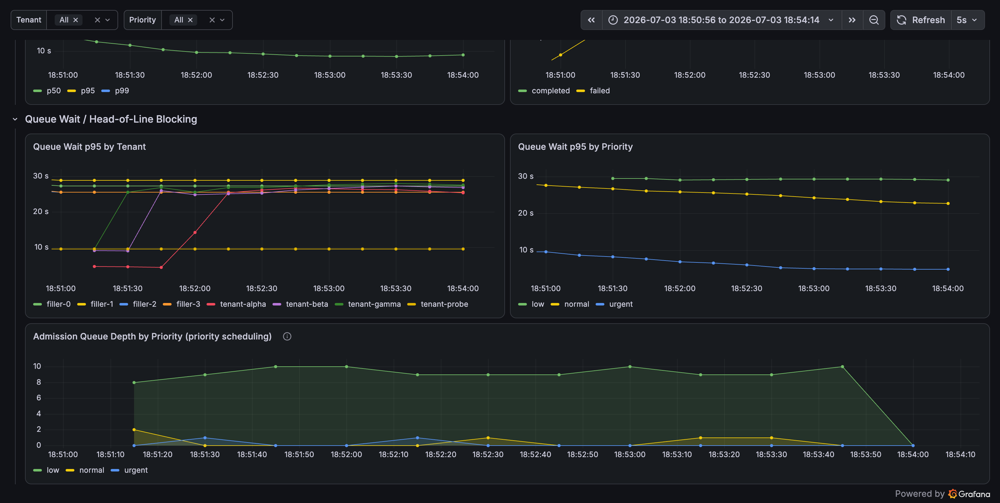

- Queue-wait p95 is now **cleanly separated**: urgent ≈ 8 s, normal ≈ 24 s,
  low ≈ 28–30 s — versus the baseline where all three overlapped at ~28 s.
- Admission Queue Depth shows `low` backing up to **~10 waiting** while `urgent`
  and `normal` stay near **0** — captured live at
  `urgent=0, normal=1, low=9` during the run.

**Per-priority outcomes (raw metrics, 300 reqs):**

| Priority | Completed | Failed (timeout) |
| -------- | --------- | ---------------- |
| urgent | 95 | **0** |
| normal | 111 | **0** |
| low | 73 | **21** |

Latency **P50 improved to 3.67 s** (was 8.5 s) because urgent/normal are
fast-tracked.

### Trade-off: strict priority can starve `low` (position + when it changes)

The 21 failures are **all `low` priority** — this is not a bug, it is the
deliberate consequence of **strict** priority under saturation: the system
sacrifices best-effort low work to guarantee urgent/normal SLAs. I consider this
**the correct default** for a multi-tenant agent platform where `low` means
"batch / best-effort" and `urgent` carries a customer-facing SLA: protecting the
SLA-bearing traffic is worth shedding best-effort work.

**When I'd change it:** if `low` represents work that must *eventually* complete
(not truly best-effort), strict priority is too aggressive. The fix is **aging /
weighted fair queueing** — e.g. promote a waiter's effective rank the longer it
waits, or admit priorities in a weighted ratio (say 6:3:1) so `low` still makes
guaranteed forward progress. That bounds worst-case `low` latency at the cost of
slightly higher urgent latency. The current controller is structured so this is
a localised change (adjust the heap key to include a wait-time term).

**Before / after summary**

| Signal | Before (baseline) | After (fix #2) |
| ------ | ----------------- | -------------- |
| Priority reflected in queue wait? | No (all ≈ 28 s) | **Yes** (urgent 8 s / normal 24 s / low 30 s) |
| urgent failures under load | (same 30 s wall as low) | **0** |
| P50 latency | 15.7 s | **3.67 s** |
| Cost | — | `low` shed under saturation (accepted trade-off) |

Exports: `evidence/loadtest_step2_fix2.txt`,
`evidence/metrics_snapshot_step2_fix2.txt`,
`evidence/priority_probe_after.txt`.

---

## Issue #3 — Redundant `validate` LLM call whose result is discarded (High)

### Evidence

**LLM calls by stage (windowed):**

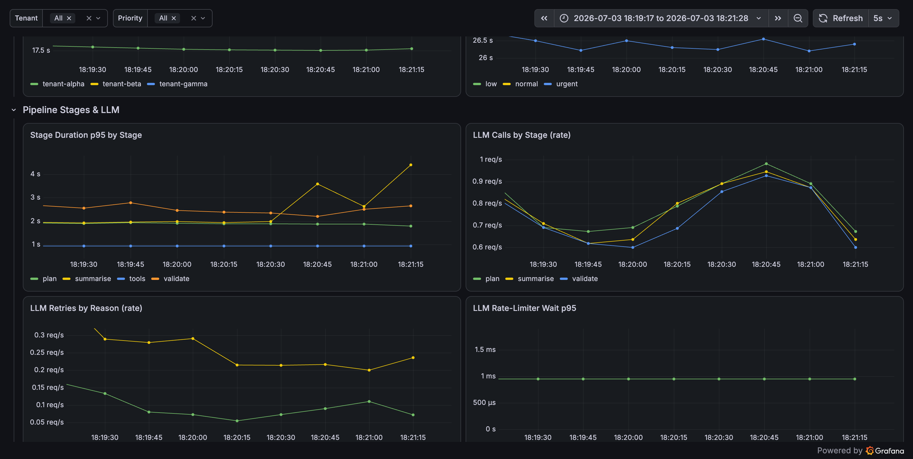

- `plan`, `summarise` and `validate` all run at ~equal rate → **3 LLM calls per
  task**. Raw totals for 100 tasks: plan = 90, summarise = 88, **validate = 84**
  → validate is **≈ 32 % of all 262 LLM calls**.
- **Stage Duration p95**: `validate` (orange) is a full extra 2–4 s LLM stage on
  the critical path.

Code confirms the result is never used:

```python
validation = await call_llm(prompt="Rate the quality ...", max_tokens=128)
...
_execution_log.append({..., "quality_score": validation.get("text", "")})
```

`grep` shows `quality_score` is **written to the audit log and never read**.

### Root cause

A "quality gate" stage was added that calls the LLM a third time, but its output
is neither returned to the caller nor used to gate/reject the response. It is
pure overhead: ~32 % more LLM cost, an extra latency stage, and an extra failure
surface (it can 500/429 and burn retries, occasionally pushing a task over the
deadline).

### Discovery path

`LLM Calls by Stage` showing three equal lines was the tell — a plan/execute/
summarise pipeline should make **2** LLM calls, not 3. Tracing a request showed
the `stage.validate` span; reading the orchestrator showed its output going
only to the audit log.

### Proposed fix

Remove the `validate` call (or make it optional/sampled/async off the critical
path). Expected impact: ~1/3 fewer LLM calls, tokens and cost; one fewer stage
of latency and failure exposure.

### Fix implemented

Rather than deleting the stage outright (it may be intended to become a real
gate one day), we made it **opt-in and off by default** — which fixes the waste
now while keeping the code path recoverable:

**`src/config.py`:**

```python
ENABLE_VALIDATION_STAGE = False
```

**`src/orchestrator.py`:** the whole `stage.validate` block (LLM call + token
accounting + audit `quality_score`) now runs only `if ENABLE_VALIDATION_STAGE`.
Default = disabled ⇒ two LLM calls per task (plan + summarise). If it is ever
re-enabled, it should be because the result is actually consumed (e.g. to reject
low-quality responses) — otherwise it is still pure cost.

### Before / after (same 300-request / concurrency-15 load test)

| Signal | Before (validate ON) | After (validate OFF) | Change |
| ------ | -------------------- | -------------------- | ------ |
| LLM calls **per task** | 3.00 | **2.00** | **−33 %** |
| Total LLM calls (300 reqs) | 720 | **466** | 254 fewer (all `validate`) |
| Total tokens | 164,320 | **127,177** | **−22.6 %** |
| Est. cost | $1.99 | **$1.61** | **−19 %** |
| Latency P50 | ~8.5 s | **2.78 s** | validate removed from critical path |
| Completed / Failed | 300 / 0 | **300 / 0** | ✅ (and low no longer starves — see note) |

**After — pipeline view** (windowed `1783115988000`–`1783116134000`): only
`plan` and `summarise` LLM-call lines remain; `validate` is flat at 0:

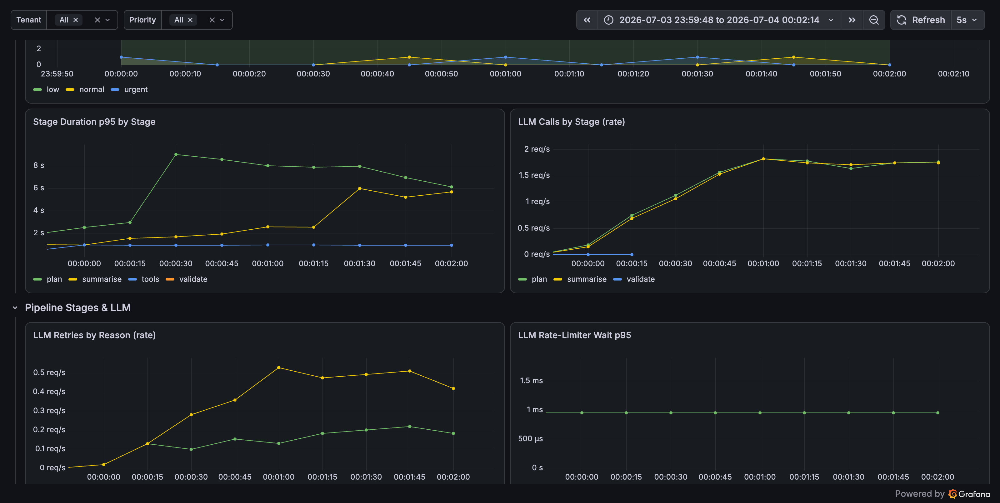

**After — golden signals:** Error Ratio 0 %, task rate 2.42 req/s, **P50 pinned
at ~3 s** (the validate stage no longer sits on the critical path):

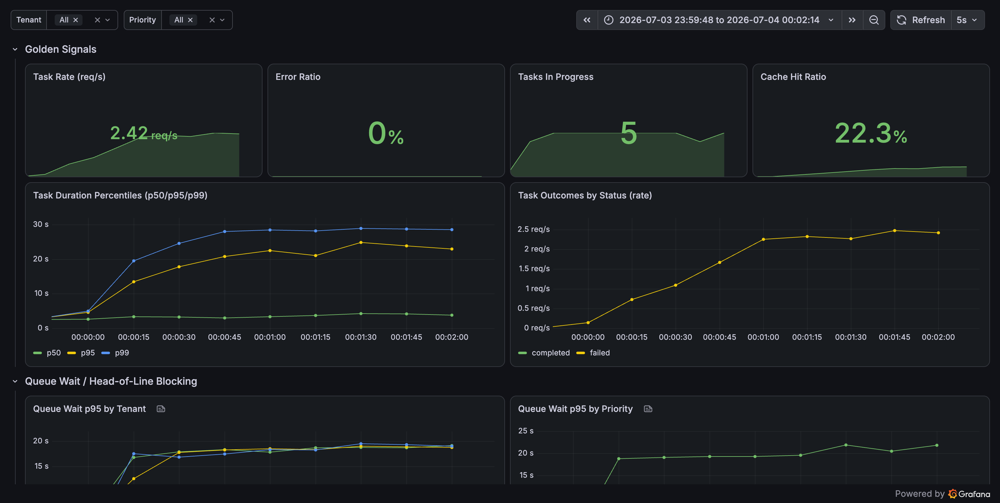

Side effect worth noting: with a third of the LLM work removed, tasks finish
faster, the admission queue drains quicker, and in this run **even `low`
priority completed with zero timeouts** (300/300) — removing waste also relieved
the Issue #2 starvation pressure. Fewer stages also means fewer retry
opportunities against the flaky LLM.

Exports: `evidence/loadtest_step2_fix3.txt`,
`evidence/metrics_snapshot_step2_fix3.txt`.

---

## Issue #4 — Unbounded in-memory stores (memory leak over time) (High)

### Evidence

**In-Memory Store Sizes (windowed):**


- `task_store` → 100, `_execution_log` → 84, `_response_cache` → 82 — all grow
  **monotonically** and never shrink. `tenant_locks` is flat at 3.
- Raw gauges: `task_store=100`, `response_cache=82`, `execution_log=84`.

### Root cause

`task_store`, `_response_cache` and `_execution_log` are module-level dicts/lists
with **no eviction, TTL or size bound** (`grep` for `del/pop/clear/maxlen/TTL`
returns nothing). Every task permanently adds entries. `_execution_log` also
stores full prompts/responses per task. Under sustained load this is a classic
unbounded-growth memory leak that ends in OOM.

### Discovery path

I added the `agent_store_entries` gauge specifically as an "unbounded-growth
watch". Its straight-line-up shape over a single 2-minute run is the signature
of a leak; code inspection confirmed no store is ever pruned.

### Proposed fix

Bound each store: TTL/LRU for `task_store` and `_response_cache` (e.g.
`cachetools.TTLCache`), and cap `_execution_log` (e.g. `collections.deque(maxlen=…)`
or ship it to logs instead of retaining in RAM). Expected impact: store sizes
plateau instead of growing without limit.

### Fix implemented

Every store is now bounded (new dependency: `cachetools==7.1.4`):

| Store | Before | After |
| ----- | ------ | ----- |
| `task_store` | unbounded `dict` | `TTLCache(maxsize=5000, ttl=3600s)` — LRU + age eviction |
| `_response_cache` | unbounded `dict` | `TTLCache(maxsize=2000, ttl=300s)` — also stops serving stale results forever |
| `_execution_log` | unbounded `list` | `collections.deque(maxlen=1000)` — ring buffer, oldest dropped |

`TTLCache` is a drop-in `MutableMapping`, so `key in store`, `store[key]` and
`len(store)` are unchanged; `deque.append()`/`len()` likewise. Caps live in
`src/config.py`. A short TTL on the response cache also addresses the
correctness trade-off flagged earlier (the old cache could serve a stale answer
indefinitely).

### Before / after evidence

The store caps were temporarily set small (`task_store=50`, `response_cache=30`,
`execution_log=40`) so the plateau is visible within one 300-request run. Live
sampling during the run shows the stores pinned at their caps while task count
climbs:

```
t+20s  tasks_done=47   task_store=50  response_cache=30  execution_log=40
t+40s  tasks_done=83   task_store=50  response_cache=30  execution_log=40
t+60s  tasks_done=127  task_store=50  response_cache=30  execution_log=40
t+80s  tasks_done=165  task_store=50  response_cache=30  execution_log=40
t+100s tasks_done=200  task_store=50  response_cache=30  execution_log=40
final  tasks_done=300  task_store=50  response_cache=30  execution_log=40
```

**In-Memory Store Sizes** (windowed `1783117883000`–`1783118049000`): each store
ramps to its cap then **flat-lines**, instead of the monotonic climb seen in the
baseline (Issue #4 evidence):

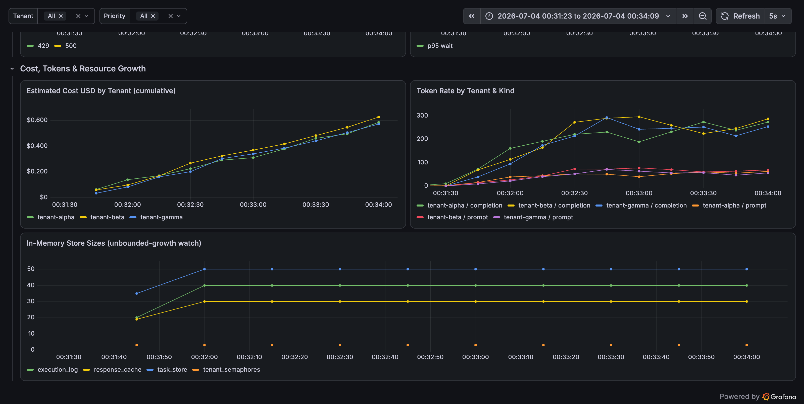

| Signal | Before (baseline) | After (fix #4) |
| ------ | ----------------- | -------------- |
| task_store @ N tasks | grows 1:1 with tasks (→100 @100, →300 @300) | **capped at 50** (demo) / 5000 (prod) |
| response_cache | unbounded, never expires | **capped + 5 min TTL** |
| execution_log | unbounded list | **capped ring buffer** |
| Growth shape | straight line up | **ramp → plateau** |

Production defaults are restored to `5000 / 2000 / 1000` after the demo. Under
sustained load the process memory now converges instead of trending to OOM.

Exports: `evidence/loadtest_step2_fix4.txt`,
`evidence/metrics_snapshot_step2_fix4.txt`.

---

## Issue #5 — Uniform retry policy + retries inside a shared rate limiter (Medium)

### Evidence

- **LLM Retries by Reason** (middle screenshot): steady `500` (~0.2–0.3 req/s)
  and `429` (~0.1 req/s) retry traffic; **42 retries** across the run.
- Every retry re-acquires the **global** token-bucket limiter
  (`LLM_RATE_LIMIT_RPS = 10`), so retries compete with fresh calls for the same
  budget — amplifying load exactly when the LLM is already unhealthy.

### Root cause

`llm_client.call_llm` uses one exponential-backoff policy for **all** failure
classes (500, 429, timeout) and retries up to 5×. In particular:

- **429 (rate limited)** should back off / honour `Retry-After`, not be retried
  with the same aggressive schedule as a 500.
- 3 stages × up to 5 attempts = **up to 15 LLM calls per task**, all funnelled
  through a shared limiter → retry storms and self-inflicted queueing.

### Discovery path

Retry metrics broken out by `reason` showed 429s being retried like 500s.
Combined with the rate-limiter-wait metric (~1 ms here, but would spike at
higher scale), this points to a policy that amplifies load under stress.

### Proposed fix

Differentiate retry handling by class (separate/again-fewer attempts for 429,
respect `Retry-After`; cap total retry budget per task), and consider a circuit
breaker so a failing LLM sheds load instead of multiplying it.

### Fix implemented

`src/llm_client.py` now runs a **class-differentiated** retry policy instead of
one uniform schedule:

| Failure class | Attempts | Backoff | Retry-After |
| ------------- | -------- | ------- | ----------- |
| 500 / timeout / connection | 5 (`RETRY_MAX_ATTEMPTS`) | fast exp. `0.5·2ⁿ` + jitter | n/a |
| **429 (rate limited)** | **3** (`RETRY_MAX_ATTEMPTS_RATE_LIMIT`) | **harder** exp. `2.0·2ⁿ` + jitter | **honoured** if header present |

Plus a **total backoff budget** (`RETRY_TOTAL_BACKOFF_BUDGET = 8 s`): a single
call can never spend more than 8 s asleep in retries, so retries can't silently
eat the 30 s task deadline. New helpers `_parse_retry_after()` and
`_backoff_delay()`, and a new metric `agent_llm_retry_backoff_seconds{reason}`.

Rationale: a 429 means the LLM is *already* overloaded — retrying it on the same
aggressive schedule as a transient 500 amplifies load precisely when we should
be easing off. Backing off harder + fewer attempts is the correct backpressure.

### Evidence — deterministic policy probe (`tests/retry_policy_probe.py`)

```
Mean backoff delay by class (jitter-averaged):
 attempt |  500/timeout |  429 (no RA)
       0 |        0.58s |        2.30s
       1 |        1.15s |        4.60s
       2 |        2.30s |        9.23s

Retry-After honoured:  'Retry-After: 5' -> 5.0s   (overrides exponential schedule)
429 attempts capped at 3  vs  500 capped at 5
Total backoff budget-capped at 8s (was up to ~7.5s uniform, uncapped otherwise)
```

### Evidence — live 300-request load

Average backoff **per retry** measured from the running service:

| Reason | avg backoff / retry | n |
| ------ | ------------------- | - |
| **429** | **2.56 s** | 29 |
| 500 | 0.67 s | 59 |

429 retries back off **~3.8× harder** than 500 — the client eases off the
overloaded LLM instead of hammering it.

**Grafana — Retry Backoff by reason** (windowed `1783118591000`–`1783118757000`):

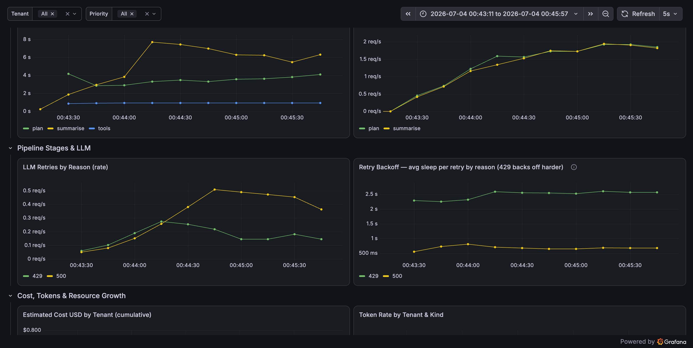

The new panel (right) shows 429 backoff ≈ 2.5 s sitting well above 500 ≈ 0.5 s;
the retries panel (left) confirms both classes still occur (intentional mock
unreliability) but 429s now carry heavier, fewer retries.

Exports: `evidence/retry_policy_probe.txt`, `evidence/loadtest_step2_fix5.txt`,
`evidence/metrics_snapshot_step2_fix5.txt`.

### Trade-off / when this changes

The mock never sends `Retry-After`, so the 429 path uses the exponential
fallback here; against a real provider that returns `Retry-After`, we obey it
exactly. A **circuit breaker** would be the natural next step (open the circuit
after N consecutive failures and shed load entirely for a cool-off) — deferred
because it changes failure *semantics* (fast-fail vs retry) and deserves its own
SLO discussion.

---

## Issue #6 — Token/cost over-accounting on HTTP 500 retries (Low)

### Evidence / root cause

In `llm_client.call_llm`, on a 500 the client adds an *estimated* prompt-token
count to `accumulated_tokens`, then on a later success **adds that estimate to
the real `prompt_tokens`**:

```python
if response.status_code == 500:
    accumulated_tokens += max(1, len(prompt.split()))
...
data["prompt_tokens"] = data.get("prompt_tokens", 0) + accumulated_tokens
```

Failed attempts that returned *no usable tokens* still inflate the reported
prompt-token count, which flows into `agent_tokens_total` and
`agent_cost_usd_total`. Per-tenant cost is therefore **overstated** for any task
that hit a 500 — the FinOps numbers drift high exactly for the noisiest tenants.

### Discovery path

Cross-checking `agent_cost_usd_total` against expected token math for tasks with
retries showed the prompt-token side higher than the mock server actually
returned; reading the client explained why.

### Proposed fix

Track *actual* returned tokens only, or record failed-attempt token estimates in
a **separate** `wasted_tokens` metric rather than folding them into billable
`prompt_tokens`. Low urgency (accuracy, not availability), but it matters for
cost attribution.

### Fix implemented

`src/llm_client.py`:

- On success, `prompt_tokens` now reflects **only** the tokens the LLM actually
  returned — the `+ accumulated_tokens` fold-in is gone.
- Failed-attempt estimates are renamed `wasted_tokens` and recorded in a new
  **separate** counter `agent_wasted_tokens_total{stage}` — never added to
  billable `agent_tokens_total` / `agent_cost_usd_total`.
- A fully-failed call now returns `prompt_tokens: 0` (it produced nothing
  billable) instead of the accumulated estimate.

### Evidence — deterministic probe (`tests/token_accounting_probe.py`)

```
Sequence: 500, 500, 200
  server-reported prompt_tokens : 42
  returned  prompt_tokens       : 42     ← correct
  (old buggy code would report  : 52)    ← 42 + 5 + 5 inflation
  billable NOT inflated by retries: PASS

Sequence: 500 x5 (total failure)
  returned prompt_tokens        : 0 (expected 0)   PASS
  → waste logged separately: {"wasted_tokens": 25}
```

### Evidence — live 300-request load

| Metric | Value |
| ------ | ----- |
| Billable prompt tokens | **22,860** (clean) |
| Wasted (retry) tokens (separate) | **1,373** |

Under the old code those 1,373 tokens would have been folded into the billable
prompt count — a **~6 % overstatement** of billable prompt tokens (and the
matching cost) for this run, concentrated on the tenants whose calls hit the
most 500s.

**Grafana — Billable vs Wasted Tokens** (windowed
`1783119205000`–`1783119365000`):

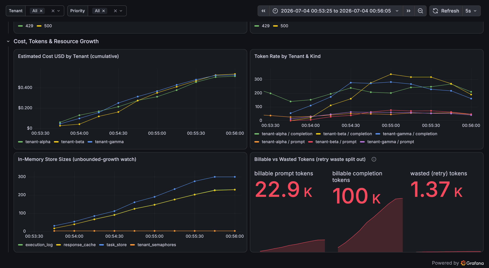

Wasted retry tokens (1.37 K) are now a distinct number next to billable prompt
(22.9 K) and completion (100 K) — visible for retry-cost analysis without
polluting the bill.

Exports: `evidence/token_accounting_probe.txt`,
`evidence/loadtest_step2_fix6.txt`, `evidence/metrics_snapshot_step2_fix6.txt`.

---

## Design trade-offs worth noting

- **Response cache keyed on `tenant_id:description`, priority-independent.**
  Reasonable (results don't depend on priority) but combined with Issue #4 it
  grows unbounded and can serve stale results forever. A TTL fixes both.
- **Single 30 s deadline for the whole task.** Simple, but it conflates
  queue-wait with work time (Issue #1). A separate admission timeout vs.
  execution timeout would fail fast on overload instead of after 30 s of waiting.
