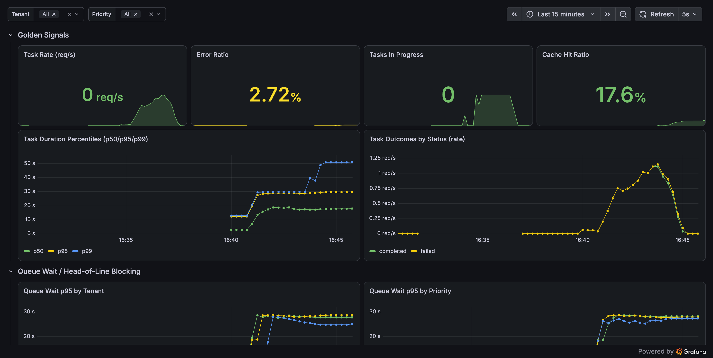
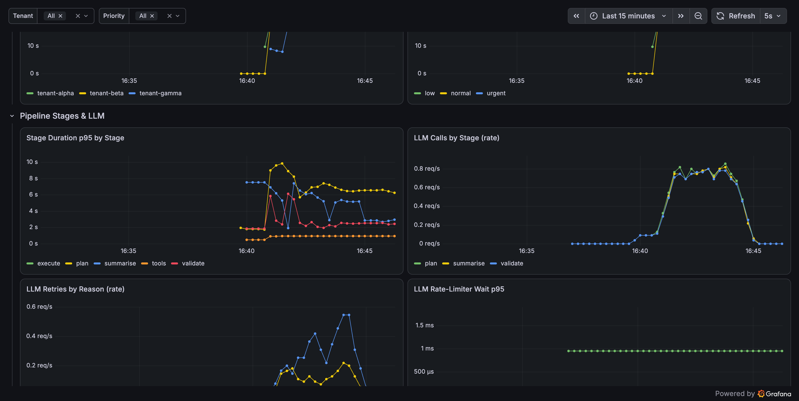
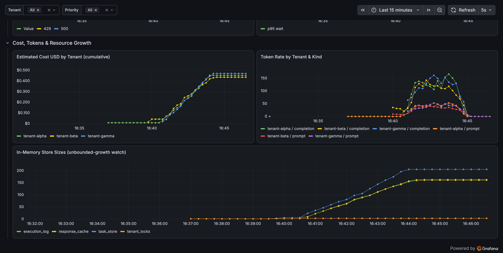
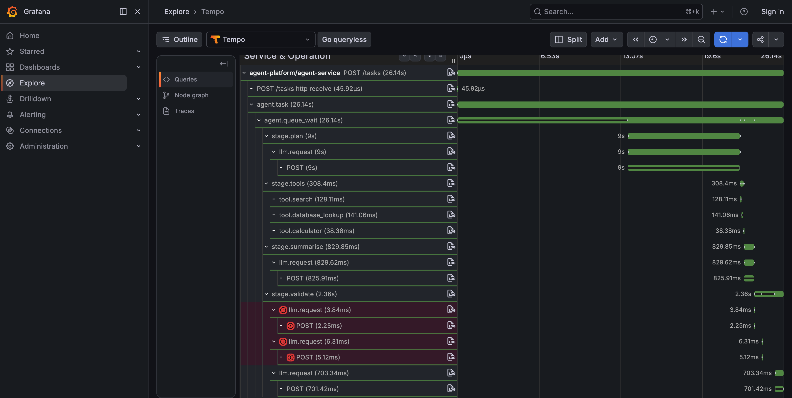
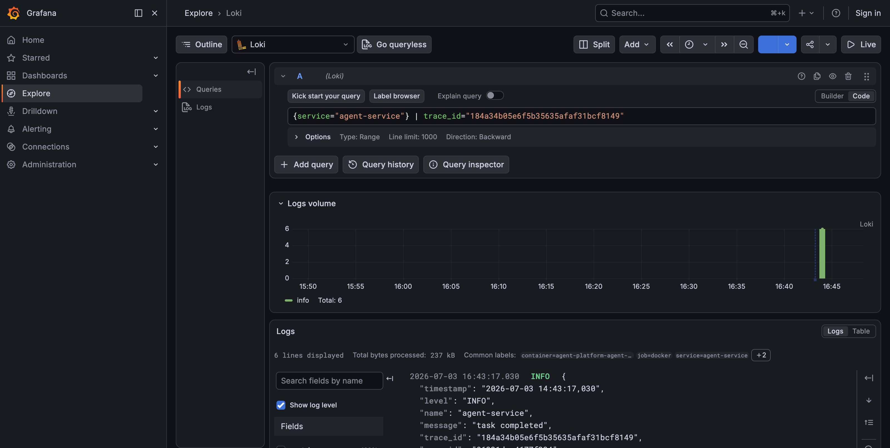

# Agent Execution Service — Observability

An AI agent execution service (FastAPI) instrumented with a production-grade,
vendor-neutral observability stack. This repository covers **Step 1 of the
challenge: instrumentation**. Diagnosis and fixes are tracked separately in
`DIAGNOSIS.md`.

---

## 1. What runs where

Everything comes up with a single `docker compose up`.

| Pillar   | How it is produced                              | Stored in | Viewed in |
| -------- | ----------------------------------------------- | --------- | --------- |
| Metrics  | `prometheus-client` on `GET /metrics`           | Prometheus | Grafana   |
| Traces   | OpenTelemetry SDK → OTLP/HTTP → OTel Collector  | Tempo      | Grafana   |
| Logs     | structured JSON to stdout → **Grafana Alloy**   | Loki       | Grafana   |

```
                         ┌──────────────────────────────────────────┐
                         │              agent-service                 │
   POST /tasks  ───────► │  FastAPI (auto-instrumented)               │
                         │   ├─ agent.task / queue_wait spans         │
                         │   ├─ stage.plan/tools/summarise/validate   │
                         │   ├─ tool.* + llm.request spans (httpx)    │
                         │   ├─ /metrics  (prometheus-client)         │
                         │   └─ JSON logs w/ trace_id  → stdout       │
                         └───────┬─────────────┬────────────┬─────────┘
                        OTLP/HTTP│      scrape  │     docker │ logs
                                 ▼              ▼            ▼
                        ┌─────────────┐  ┌────────────┐  ┌───────┐
                        │OTel Collector│ │ Prometheus │  │ Alloy │
                        │ + spanmetrics│ └─────┬──────┘  └───┬───┘
                        └──────┬───────┘       │             ▼
                          OTLP │               │          ┌──────┐
                               ▼               │          │ Loki │
                          ┌────────┐           │          └──┬───┘
                          │ Tempo  │           │             │
                          └────┬───┘           │             │
                               └──────────► Grafana ◄─────────┘
                                     (traces ↔ logs ↔ metrics)
```

### Component ports

| Service        | URL / port                    |
| -------------- | ----------------------------- |
| agent-service  | http://localhost:8080         |
| mock-llm       | http://localhost:8081         |
| Grafana        | http://localhost:3000 (anonymous admin) |
| Prometheus     | http://localhost:9090         |
| Tempo          | http://localhost:3200         |
| Loki           | http://localhost:3100         |
| OTel Collector | 4317 (gRPC) / 4318 (HTTP) / 8889 (span-metrics) |
| Alloy UI       | http://localhost:12345        |

---

## 2. How to run

```bash
# 1. Build & start the whole stack (app + mock LLM + observability)
docker compose up -d --build

# 2. Sanity checks
curl -s localhost:8080/health           # {"status":"ok"}
curl -s localhost:8080/metrics | head   # Prometheus exposition

# 3. Submit a single task
curl -s -X POST localhost:8080/tasks \
  -H 'Content-Type: application/json' \
  -d '{"task_description":"Analyse quarterly revenue","tenant_id":"tenant-alpha","priority":"urgent"}'
```

### Reproduce the load test

```bash
# From the host (uses the .venv or any Python 3.10+ with httpx):
python -m tests.test_load
```

`TOTAL_REQUESTS` / `CONCURRENCY` at the top of `tests/test_load.py` control
intensity. For sustained load, raise `TOTAL_REQUESTS` and run several rounds.

---

## 3. How to view traces / metrics / logs

Open **Grafana → http://localhost:3000** (no login required).

* **Dashboard:** `Agent Platform → Agent Platform — Overview`. Templating
  variables let you slice everything by **tenant** and **priority**.
* **Traces:** *Explore → Tempo*. Search `{}` for recent traces, or paste a
  trace ID. Every span has a **“Logs for this span”** button that pivots
  straight to the matching Loki logs.
* **Logs:** *Explore → Loki*, e.g.
  `{service="agent-service"} | trace_id="<id>"`. Click the `trace_id` derived
  field in any line to jump back to the trace in Tempo.

---

## 4. Instrumentation design

### Tracing (`src/telemetry.py`, wired throughout)

* FastAPI and httpx are **auto-instrumented**, so every inbound request and
  every outbound LLM HTTP call is a span for free.
* The orchestrator adds a manual span tree so a single request tells the full
  story end-to-end:

  ```
  agent.task
  └─ agent.queue_wait          # time blocked on tenant lock + semaphore
     ├─ stage.plan → llm.request → POST (httpx)
     ├─ stage.tools → tool.search / tool.database_lookup / tool.calculator
     ├─ stage.summarise → llm.request → POST
     └─ stage.validate → llm.request (×retries, errors flagged red)
  ```

* `llm.request` spans carry `llm.stage`, `llm.attempt`, `http.status_code`,
  so retries and failures are visible on the timeline.

### Metrics (`GET /metrics`, `prometheus-client`)

Chosen to be **sliceable by the dimensions that matter operationally**
(tenant / priority / stage / status), because aggregate numbers hide
multi-tenant and per-stage problems:

| Metric                               | Type      | Key labels                | Answers |
| ------------------------------------ | --------- | ------------------------- | ------- |
| `agent_tasks_total`                  | counter   | tenant, priority, status  | request & error rate |
| `agent_task_duration_seconds`        | histogram | tenant, priority, status  | end-to-end latency |
| `agent_task_queue_wait_seconds`      | histogram | tenant, priority          | head-of-line blocking |
| `agent_tasks_in_progress`            | gauge     | –                         | live concurrency |
| `agent_cache_events_total`           | counter   | result (hit/miss)         | cache effectiveness |
| `agent_stage_duration_seconds`       | histogram | stage, tenant, priority   | which stage is slow |
| `agent_llm_calls_total`              | counter   | stage, outcome            | LLM call volume |
| `agent_llm_request_seconds`          | histogram | stage, status_code        | per-attempt LLM latency |
| `agent_llm_retries_total`            | counter   | stage, reason             | retry storms |
| `agent_llm_rate_limit_wait_seconds`  | histogram | –                         | client-side throttling |
| `agent_tokens_total`                 | counter   | tenant, kind              | token consumption |
| `agent_cost_usd_total`               | counter   | tenant                    | per-tenant spend (FinOps) |
| `agent_store_entries`                | gauge     | store                     | unbounded-growth watch |

The OTel Collector also derives RED span metrics (`traces_span_metrics_*`) so
per-span rate/error/duration is available even without bespoke metrics.

### Logs

* `python-json-logger` emits one structured JSON object per line.
* A logging filter injects the active **`trace_id` / `span_id`** into every
  record, so logs join to traces both ways in Grafana.
* Alloy tails the Docker logs, parses the JSON, promotes `level` to a label
  and `trace_id`/`span_id`/`tenant_id`/`task_id` to Loki **structured
  metadata** (queryable, low-cardinality-safe).

---

## 5. Instrumentation evidence (Step 1)

All screenshots below come from a real `docker compose` run driven by
`tests/test_load.py` (100 requests, concurrency 15). Raw exports are in
`evidence/`.

### Overview dashboard — golden signals

Error ratio, cache hit ratio, task rate, and task-duration percentiles.
`p95`/`p99` pile up against the 30 s timeout wall under load.



### Queue wait & pipeline stages

Queue-wait p95 (per tenant / per priority) and per-stage p95 latency, showing
the extra `validate` stage and LLM retry rate.



### Cost, tokens & resource growth

Per-tenant estimated spend, token rates, and — importantly — the in-memory
stores (`task_store`, `response_cache`, `execution_log`) growing monotonically
and never shrinking.



### End-to-end trace waterfall

A single 26 s request: the whole duration is `agent.queue_wait`, `stage.plan`
alone is 9 s, and `stage.validate` shows **red, retried `llm.request` spans**
(HTTP 500s). This is the primary artifact for the diagnosis phase.



### Trace ↔ log correlation

Querying Loki by the trace’s ID returns exactly that request’s structured log
lines — proving the correlation loop works end-to-end.


